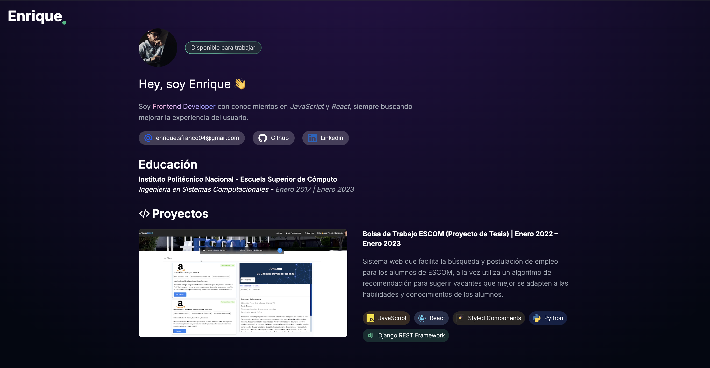

# Portafolio - Frontend Developer

¡Bienvenido a mi portafolio de Frontend Developer! Aquí podrás explorar algunos de los proyectos que he creado utilizando tecnologías web modernas. Mi objetivo es siempre crear interfaces de usuario intuitivas, responsivas y accesibles. A continuación, encontrarás una descripción general de los proyectos que forman parte de mi portafolio, así como las tecnologías que utilizo.

🚀 Sobre mí
Soy Frontend Developer con conocimientos en JavaScript, TypeScript y React, siempre buscando mejorar la experiencia del usuario. Además, me interesa seguir aprendiendo y explorar nuevas tecnologías, lo que me permite adaptarme a distintos proyectos y aportar soluciones prácticas.

🛠️ Tecnologías que utilizo
HTML5: Estructuración de contenido y accesibilidad web.

Tailwind: Diseño visual, Flexbox y Grid.

Astro: Framework para crear sitios estáticos rápidos y modernos.

💻 Proyectos Destacados
1. BOLSA DE TRABAJO ESCOM (PROYECTO DE TESIS)
Descripción: Breve descripción de lo que hace el proyecto. Por ejemplo, una plataforma de comercio electrónico con un diseño atractivo y una interfaz de usuario dinámica.

Tecnologías utilizadas: React, Context, Redux, Styled Components, Axios, Python, DJango REST FRAMEWORK.

2. DETECCIÓN DE TOXICIDAD (PROYECTO PERSONAL)
Descripción: Aplicación web para detectar en tiempo real los mensajes con lenguaje tóxico en las comunidades de canales de Twitch.

Tecnologías utilizadas: JavaScript React, TailwindCss, tmi.js, nodejs, y API REST.

3. INTELLICE CV (PROYECTO PERSONAL)
Descripción: Breve descripción del proyecto. Por ejemplo, una página de portafolio personal.

Tecnologías utilizadas: Typescript, React, TailwindCss, Zustand, Dnd kit, TipTap Editor.

